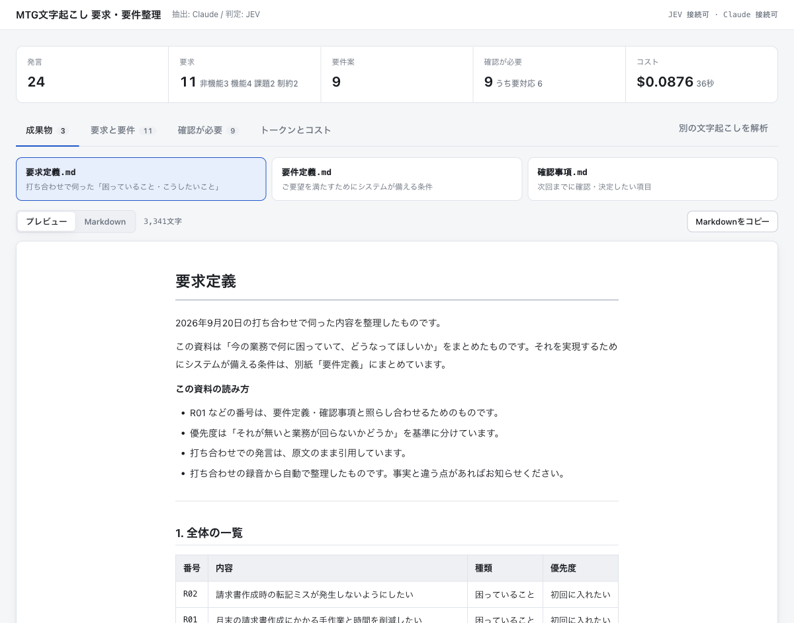
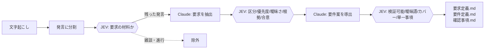
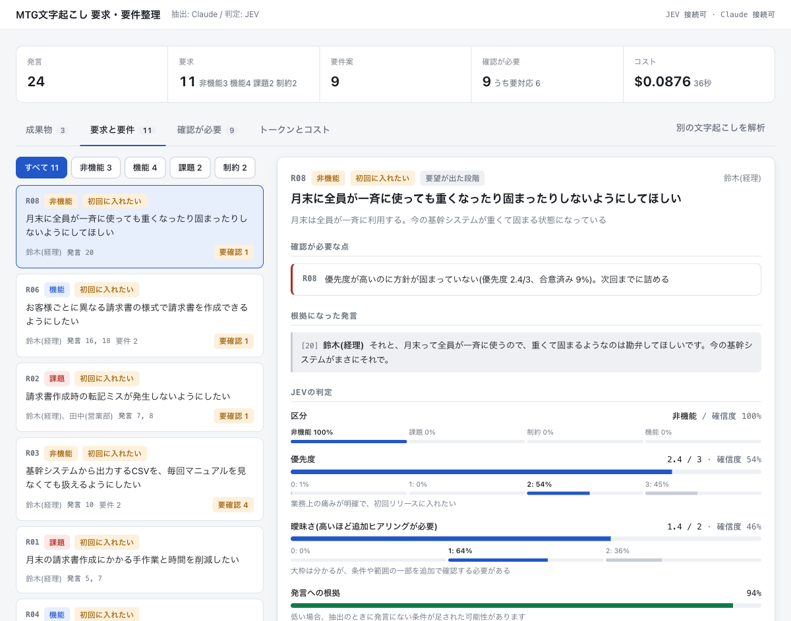

# jev-requirements-extractor

打ち合わせの文字起こしから、要求と要件を整理するツール。
判定専用AI **JEV** と **Claude** を役割分担させている。

文字起こしを貼ると、`要求定義.md` / `要件定義.md` / `確認事項.md` の3つが出てくる。
数値や専門用語を使わずに書いてあるので、そのまま非エンジニアに見せられる。



## なぜ2つのモデルを分けたか

JEV は「はい/いいえ」「A・B・Cのどれか」「0〜3点」を**確率つきで**返す判定専用のモデルで、
文章を生成しない。そこで、書く工程と判定する工程を分けた。



Claude に返させるのは要求文と要件文だけ。分類も優先度も品質チェックも書かせない。

## 実測で分かったこと

24発言のサンプルで計測した結果。詳しい数字と手順は **[docs/jev-findings.md](docs/jev-findings.md)** に置いてある。

### 1. 判定を JEV に寄せるとコストが70%下がる

出力トークンは入力の5倍の単価がかかる($25 vs $5 per 1M / Opus 5)。
一方 JEV は**出力が無料**で、入力も $0.042 per 1M と桁が違う。

| 内訳 | リクエスト | トークン | コスト |
| --- | --- | --- | --- |
| JEV(要求5軸 + 要件4軸 + 前段選別) | 22 | 入力 29,633 / 出力 2,877(無料) | $0.00124 |
| Claude Opus 5(抽出・導出) | 3 | 入力 4,538 / 出力 2,275 | $0.07956 |
| **合計** | | | **$0.08081** |
| 同じ判定をすべて Claude で行った推定 | | | $0.27001 |

JEV のコストは全体の **1.5%**。判定軸を5個から10個に増やしても誤差の範囲で収まる。

### 2. 質問を否定形で書くと判定が反転する

同じ要件に対して、聞き方だけを変えて比較した結果。

| 要件 | 「曖昧語が**含まれていないか**?」 | 「曖昧語が**含まれるか**?」 |
| --- | --- | --- |
| 営業のユーザーが過去の請求履歴を閲覧できること | 0.46 | 0.20 |
| 同時接続100ユーザーで一覧表示が3秒以内 | 0.53 | 0.14 |
| 請求業務を**適切に**効率化できること | **0.82** | 0.97 |
| **必要に応じて柔軟に**帳票を出力できること**等** | **0.85** | 0.98 |

左は期待と真逆になっている(曖昧な要件ほど「曖昧語を含まない」が高く出る)。
**探したい対象を肯定形でそのまま聞き、解釈は呼び出し側で行うこと。**

### 3. 前段フィルタでトークンを削る効果は、ほぼ誤差

「JEV で雑談を落としてから Claude に渡せば安くなる」と考えたが、実測では効かなかった。

| | JEVコスト | Claude入力 | Claude出力 | 合計 |
| --- | --- | --- | --- | --- |
| 前段フィルタ ON | $0.00124 | **4,538** | 2,275 | $0.08081 |
| 前段フィルタ OFF | $0.00104 | **4,547** | 1,971 | $0.07305 |

文字数を15%落としても Claude の入力はほぼ変わらない。入力の大半はシステムプロンプトで、
文字起こし本体は一部でしかないため。思考トークンのブレのほうが一桁大きい。

なお、取りこぼしは起きなかった。文脈依存の発言(「それ、めちゃくちゃ困ってます」)も
0.92〜0.96 で拾えている。**精度は落ちないが、削減効果も出ない。**

## 確率が返ることが、要件定義では効く

Claude に「優先度は?」と聞くと「高」としか返らない。JEV は分布を返す。

```json
"priority": { "score": 2.4, "confidence": 0.54,
              "probabilities": { "0": 0.01, "1": 0.0, "2": 0.54, "3": 0.45 } }
```

確信度が低い = 判断が割れている = 人が見るべき、として機械的にフラグを立てられる。



実際に拾えたもの:

| 検出内容 | 値 |
| --- | --- |
| 要件が元の要求をカバーしていない | カバー 39% |
| 「移行するなら過去2年分」→「稼働開始時点から過去2年分」と条件が変質 | カバー 44% |
| 「検索を実行し、検索結果を閲覧できること」= 2つの事項が混在 | 単一事項 41% |
| 「来年4月の期初に本番稼働していること」= 受け入れテストが書けない | 検証可能 66% |

## 動かす

```bash
npm install
npm run dev      # → http://localhost:5273
```

APIキーは環境変数を優先し、無ければリポジトリ外の `../.tokens/` から読む。

| 変数 | フォールバック | 取得先 |
| --- | --- | --- |
| `JEV_API_KEY` | `.tokens/jev.txt` | [typesafe.ai](https://typesafe.ai/) |
| `ANTHROPIC_API_KEY` | `.tokens/claude.txt` | [Anthropic Console](https://console.anthropic.com/) |

`.tokens/` は git 管理外。キーを書いたファイルを置くだけで動く。

ポートなどの設定は `.env.example` を参照。

## 画面

- **成果物** — 3つの Markdown をプレビューする。判定の確率も業界用語も使わずに書いてある
- **要求と要件** — 要求ごとの判定内訳を確率つきで表示。根拠になった発言と要件案も見られる
- **確認が必要** — JEV の確率から機械的に立てた、人が見るべき項目
- **トークンとコスト** — JEV と Claude の消費内訳と、判定を Claude に寄せた場合との差

入力画面で前段フィルタを切り替えて2回流すと、判定内容とコストの差をその場で比較できる。

## 構成

```
.
├── server/          # BFF。APIキーはサーバー側だけに置く
│   ├── pipeline.ts  # 6工程の解析パイプライン(SSEで進捗を返す)
│   ├── jev.ts       # JEVクライアント。質問をまとめてバッチ化する
│   ├── questions.ts # JEVに投げる判定質問の定義
│   ├── claude.ts    # Claudeクライアント(structured outputs)
│   ├── prompts.ts   # 抽出・導出のプロンプト
│   ├── index.ts     # ローカル実行用の Express
│   └── lambda.ts    # Lambda 実行用(response streaming)
├── shared/types.ts  # サーバーとフロントで共有する型
├── src/             # React (Vite)
├── infra/           # CDK (S3 + CloudFront + Lambda)
└── docs/
    ├── jev-findings.md  # JEVの挙動を検証した記録
    └── deploy.md        # AWSへのデプロイ手順と、設定で引っかかった点
```

## JEV を使うときの注意

1. **質問は肯定形で書く。** 否定疑問にすると判定が反転する(上記 2)
2. **質問は1リクエストにまとめる。** 質問文はリクエストごとに繰り返されるので、
   1問ずつ投げるとトークンが3倍になる(24問を束ねて 11,497 → 3,934 トークン)
3. **判断材料は判定軸に合わせて用意する。** 「その場で合意できたか」は要望そのものではなく
   直後の応答に現れるため、根拠の発言だけを渡すと全件が未決と判定される(0.12 → 0.67)

## デプロイ

S3 + CloudFront + Lambda の構成を CDK で用意してある。手順と、OAC 経由の POST で
引っかかる点は **[docs/deploy.md](docs/deploy.md)** に書いた。

## ライセンス

MIT
