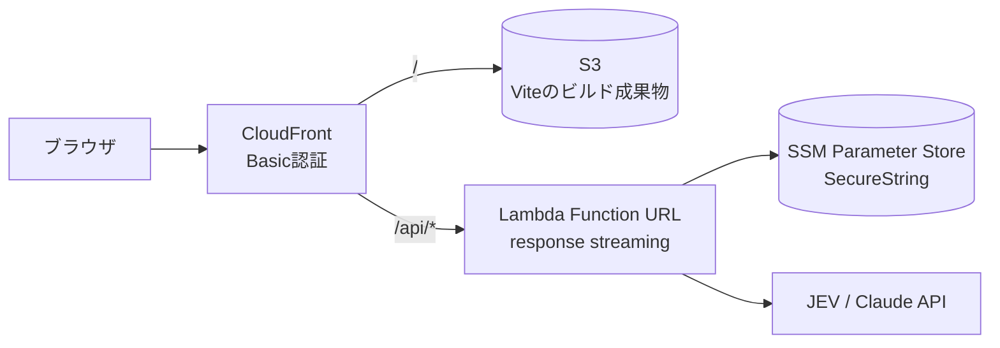

# AWS へのデプロイ (S3 + CloudFront + Lambda)

## 静的ホスティングだけでは動かない

JEV と Anthropic のどちらの API も、CORS のオリジンを allowlist で制御している。
ブラウザから直接呼ぶとプリフライトの時点で弾かれる。

```
$ curl -i -X OPTIONS https://api.typesafe.ai/v1/systemone \
    -H "Origin: https://example.cloudfront.net" \
    -H "Access-Control-Request-Method: POST"

HTTP/2 400
Disallowed CORS origin
```

仮に CORS が通ったとしても、API キーがブラウザに露出する。
APIキーを持つ層が必ず要るので、S3 + CloudFront だけでは成立しない。
最小構成として Lambda を1つ置く。



S3 と Lambda Function URL はどちらも OAC 経由でしか叩けない。APIキーは SSM の
SecureString に置くので、CloudFormation のテンプレートには残らない。

## 設定で引っかかった3点

同じ構成を組むなら、ここを外すと動かない。

### 1. OAC 経由の POST には `x-amz-content-sha256` が要る

CloudFront の OAC は Lambda Function URL へのリクエストを SigV4 で署名する。
POST ではボディのハッシュが署名対象に含まれるが、CloudFront はストリーミングされる
ボディを自分でハッシュできない。**ビューアー側がボディの SHA-256 を送る必要がある。**

付けないと CloudFront が 403 を返し、Lambda には到達しない
(CloudWatch にログも残らないので気づきにくい)。GET は通るので、ヘルスチェックだけでは
問題が表面化しない。

```ts
const body = JSON.stringify({ transcript, options });
const digest = await crypto.subtle.digest("SHA-256", new TextEncoder().encode(body));
const hex = Array.from(new Uint8Array(digest))
  .map((b) => b.toString(16).padStart(2, "0"))
  .join("");

await fetch("/api/analyze", {
  method: "POST",
  headers: { "Content-Type": "application/json", "x-amz-content-sha256": hex },
  body,
});
```

### 2. Basic 認証の `Authorization` ヘッダーは認証後に削除する

CloudFront Functions で Basic 認証をかける場合、通過後に必ずヘッダーを落とす。
残したままオリジンに転送すると、OAC が付ける署名と衝突して 403 になる。

```js
function handler(event) {
  var request = event.request;
  var auth = request.headers.authorization;
  if (!auth || auth.value !== 'Basic <base64>') {
    return { statusCode: 401, statusDescription: 'Unauthorized',
             headers: { 'www-authenticate': { value: 'Basic realm="app"' } } };
  }
  delete request.headers.authorization;  // これが要る
  return request;
}
```

### 3. SSE を通すパスは圧縮を切る

`/api/*` の behavior で `compress: false` にする。圧縮が有効だとレスポンスが
バッファされ、進捗イベントがリアルタイムに届かない。

あわせて、CloudFront のカスタムエラーレスポンス(403/404 → index.html)は入れないほうがいい。
distribution 全体に効くため、API のエラーまで index.html に化けて原因が追えなくなる。

## 手順

```bash
# 1. フロントをビルド(dist/ を CDK がアップロードする)
npm install && npm run build

# 2. APIキーを SSM に登録(初回のみ)
aws ssm put-parameter --profile <PROFILE> --type SecureString --overwrite \
  --name /jev-test/JEV_API_KEY --value "$JEV_API_KEY"
aws ssm put-parameter --profile <PROFILE> --type SecureString --overwrite \
  --name /jev-test/ANTHROPIC_API_KEY --value "$ANTHROPIC_API_KEY"

# 3. CDK のブートストラップ(そのアカウント・リージョンで初回のみ)
cd infra && npm install
AWS_PROFILE=<PROFILE> npx cdk bootstrap

# 4. デプロイ
AWS_PROFILE=<PROFILE> npx cdk deploy \
  -c basicAuthUser=<ID> \
  -c basicAuthPassword=<PASSWORD> \
  -c bucketName=<BUCKET_NAME>   # 省略すると CDK が自動生成する
```

出力される `JevTestStack.Url` が公開 URL。

撤去は `npx cdk destroy`(同じ `-c` を付ける)。S3 バケットは `autoDeleteObjects` を
有効にしてあるので中身ごと消える。SSM パラメータは残るので別途削除する。

## 費用

S3・CloudFront・Lambda はいずれも無料枠に収まる規模。実費は解析ごとの API 料金で、
24発言のサンプル1回で約 $0.08(内訳は画面の「トークンとコスト」で確認できる)。
