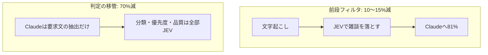

# JEV と Claude の役割分担の検証結果

このツールを作る過程で出た「JEV で一次分析して、残った情報を Claude に渡せばトークン最適化に
なるのでは。ただし精度が落ちるなら意味がない」という疑問を、実データで検証した記録。
計測は2026年9月時点のもの。

結論を先に書くと、**方向は合っているが効く場所が違う**。前段フィルタの削減効果は10〜15%にとどまり、
判定工程を JEV に移すほうが桁違いに効く(実測 70%減)。

## 0. 前提: JEV の仕様

判定専用 AI。yes/no・選択肢・段階評価を確率つきで返す。テキスト生成はしない。

| 項目 | 値 |
| --- | --- |
| エンドポイント | `POST https://api.typesafe.ai/v1/systemone` |
| 認証 | `Authorization: Bearer <key>` |
| 質問タイプ | `noul`(真偽) / `choice`(選択) / `score`(段階) |
| 単価 | 入力 $0.042 / 1M、**出力は無料** |
| 制約 | 1リクエスト64kトークン、state + 最長質問で32kまで |

比較対象の Claude の単価(入力 / 出力、$ per 1M):
Opus 5 = 5 / 25、Sonnet 5 = 2 / 10、Haiku 4.5 = 1 / 5。
JEV は Sonnet 5 の入力と比べて **約48分の1**。

レスポンス実例:

```json
{"answers":{
  "is_requirement":{"type":"noul","noul":0.98},
  "category":{"type":"choice","choice":"functional","confidence":1.0,
              "probabilities":{"functional":1.0,"constraint":0.0,"none":0.0,"nonfunctional":0.0}},
  "priority":{"type":"score","score":1.96,"confidence":0.96,
              "legend":{"0":"...","1":"...","2":"...","3":"..."},
              "probabilities":{"0":0.0,"1":0.04,"2":0.96,"3":0.0}}},
 "usage":{"input_tokens":703,"output_tokens":81}}
```

## 1. 前段フィルタの精度 — 落ちなかった

要件定義ヒアリングを想定した24発言の文字起こしで、各発言を JEV に「要求の材料になるか」判定させた。
文脈依存の発言(「それ、めちゃくちゃ困ってます」「さっきの検索の話なんですけど」)を意図的に混ぜてある。

| 条件 | 閾値0.5での取りこぼし | 文脈依存発言の判定値 |
| --- | --- | --- |
| 1発言を単体で判定 | **0件** | 0.84 / 0.96 / 0.96 |
| 直前2発言を文脈に付与 | **0件** | 0.89 / 0.97 / 0.94 |
| 全発言を1つのstateに入れて判定 | **0件** | 0.92 / 0.98 / 0.96 |

指示語の先が分からなくても、「困りごとを述べているか」という判定は成立する。
文脈を付けなくても落ちなかったので、**精度低下の懸念は杞憂だった**。

## 2. 前段フィルタの削減効果 — 期待ほど効かない

問題は精度ではなく、削れる量とフィルタ自体のコスト。

| 指標 | 値 |
| --- | --- |
| Claude に渡る文字数(閾値0.5) | 元の **75〜81%** |
| つまり削減できる量 | **19〜25%** |

要件定義の打ち合わせは要求の密度が高く、落とせるのは挨拶・進行・無関係な雑談だけ。
さらに JEV 側のトークンが乗る:

| 呼び方 | JEV入力トークン |
| --- | --- |
| 24発言を1件ずつ24リクエスト | 11,497 |
| 24問を1リクエストにまとめる | **3,934**(66%削減) |

質問文とcriteriaがリクエストごとに繰り返されるため、1問ずつ投げると元テキスト(約800トークン)の
14倍に膨れる。まとめれば5倍程度に収まる。

### 実際に両モードを流して比較した

同じ文字起こしでアプリを2回流した実測値:

| | JEVコスト | Claude入力 | Claude出力 | 合計 |
| --- | --- | --- | --- | --- |
| 前段フィルタ ON | $0.00124 | **4,538** | 2,275 | $0.08081 |
| 前段フィルタ OFF | $0.00104 | **4,547** | 1,971 | $0.07305 |

**Claude の入力トークンがほぼ変わっていない。** 文字数を15%落としたのに効果が出ない理由:

1. Claude への入力の大半はシステムプロンプトと指示文で、文字起こし本体は一部でしかない
   (このサンプルでは全体3,600トークンに対し文字起こしは約900トークン)
2. 前段フィルタで発言が飛び飛びになるため、抽出時に文脈として直前発言を添える分だけ戻る
3. 要件案の導出リクエストには根拠の発言をそのまま渡すので、そもそもフィルタの影響を受けない

計算すると、このサンプルでの前段フィルタの正味の差は **$0.0005 程度**。
一方で合計コストの差 $0.0078 は、ほぼ全部が出力トークンのブレ(304トークン × $25/1M ≒ $0.0076)で説明できる。
**思考トークンの揺らぎのほうが、フィルタの効果より一桁大きい。**

### いつなら効くか

システムプロンプトは固定長なので、文字起こしが長くなるほど比率は改善する。
1時間の打ち合わせ(約2万字)なら、文字起こしが入力の大半を占めるようになり、
削減率は10〜15%程度まで上がると見込める。ただし後述の判定移管(70%)には届かない。

## 3. 本命は後段 — 判定工程を JEV に移す

出力トークンは入力の5倍の単価($25 vs $5 / 1M on Opus 5)。
一方 JEV は**出力が無料**で、判定軸を増やしてもコストがほぼ変わらない。

サンプル(24発言 → 要求11件 → 要件案10件)での実測:

| 内訳 | リクエスト | トークン | コスト |
| --- | --- | --- | --- |
| JEV(要求5軸 + 要件4軸 + 前段選別) | 22 | 入力 29,633 / 出力 2,877(無料) | $0.00124 |
| Claude Opus 5(抽出・導出) | 3 | 入力 4,538 / 出力 2,275 | $0.07956 |
| **合計** | | | **$0.08081** |
| 同じ判定をすべて Claude で行った推定 | | | $0.27001 |
| **削減** | | | **$0.18920 / 70%** |

JEV のコストは全体の **1.5%** にすぎない。判定軸を5個から10個に増やしても誤差の範囲で収まる。



## 4. 副次効果: 確率が返ることがレビューに効く

Claude に「優先度は?」と聞くと「高」としか返らない。JEV は分布を返す。

```
"priority": {"score": 2.4, "confidence": 0.59,
             "probabilities": {"0":0.0, "1":0.0, "2":0.60, "3":0.40}}
```

確信度が低い = 判断が割れている = 人が見るべき、として機械的にフラグを立てられる。
コストの話とは別に、要件定義ツールとしてはこちらのほうが本質的な価値がある。

実際に拾えた例:

| 検出内容 | 値 |
| --- | --- |
| 要件が元の要求をカバーしていない | カバー 39% |
| 「移行するなら過去2年分」→「稼働開始時点から過去2年分」と条件が変質 | カバー 44% |
| 「検索を実行し、検索結果を閲覧できること」= 2つの事項が混在 | 単一事項 41% |
| 「来年4月の期初に本番稼働していること」= 受け入れテストが書けない | 検証可能 66% |

## 5. 質問設計の落とし穴

### 5-1. 否定疑問で聞くと判定が反転する

同じ要件に対して、質問の言い回しだけを変えて比較した。

| 要件 | A「曖昧語が**含まれていないか**?」 | C「曖昧語が**含まれるか**?」 |
| --- | --- | --- |
| 営業のユーザーが過去の請求履歴を閲覧できること | 0.46 | 0.20 |
| 請求書のPDFを一括生成できること | 0.43 | 0.27 |
| 同時接続100ユーザーで一覧表示が3秒以内 | 0.53 | 0.14 |
| 請求業務を**適切に**効率化できること | **0.82** | 0.97 |
| レスポンスが**なるべく早く**返り、**使いやすい**画面であること | **0.85** | 0.98 |
| **必要に応じて柔軟に**帳票を出力できること**等** | **0.85** | 0.98 |

A は期待と真逆(曖昧な要件ほど「曖昧語を含まない」が高い)。C は完全に分離している。

**探したい対象を肯定形でそのまま聞き、解釈は呼び出し側で行うこと。**

### 5-2. 判断材料は判定軸に合わせて用意する

「その場で合意できたか」を、根拠の発言だけを state に入れて判定させると全件が未決になった。
合意は要望そのものではなく、**直後の応答**に現れるため。

| state の内容 | 合意済み |
| --- | --- |
| 根拠の発言のみ(実際は合意あり) | 0.12 ← 誤判定 |
| 直後の応答も含む(実際は合意あり) | **0.67** |
| 直後の応答なし(実際に未決) | 0.08 |

対応: 根拠の発言の前後3発言を state に含めるようにした(`pipeline.ts` の `conversationAround`)。

この2点を直した結果、レビューフラグは **35件 → 10件** に減り、中身も的確になった。

## まとめ

| やること | 効果 |
| --- | --- |
| 判定工程を全部 JEV に寄せる | **コスト70%減 + レビュー品質の向上**。最優先 |
| JEV の質問を1リクエストにまとめる | JEV側のトークン66%減 |
| 前段フィルタで雑談を落とす | 短い文字起こしでは誤差。長尺で10〜15%減 |
| 質問を肯定形で書く | 精度が根本的に変わる。必須 |

前段フィルタは、短い文字起こしでは測定できるほどの差にならない。
ただし取りこぼしも起きなかったので、入れて損をするものでもない。
アプリ側で ON/OFF を切り替えられるようにしてあるので、実際の案件の文字起こしで2回流せば、
その長さでの差をそのまま確認できる。
